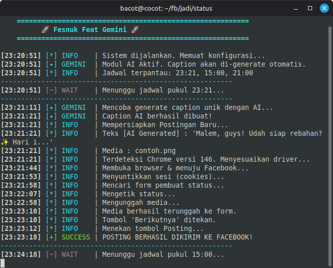

# 🚀 FB Auto Poster Feat AI GEMINI

Script otomatisasi (Bot) berbasis Python CLI untuk memposting status dan media (foto/video) ke Facebook secara terjadwal. Sangat cocok dijalankan di VPS (Virtual Private Server) Linux sebagai *Social Media Manager* autopilot Anda yang beroperasi 24/7.

Dilengkapi dengan integrasi **Google Gemini AI** untuk menghasilkan *caption* yang unik, natural, dan menyesuaikan dengan waktu (pagi/siang/sore/malam) secara otomatis untuk menghindari deteksi *spam* Facebook.

---

## 🖥️ Tampilan Bot Saat Berjalan



*Gambar di atas menunjukkan log visual bot yang rapi dan berwarna saat mengeksekusi jadwal posting.*

---


---

## ✨ Fitur Utama

- **🧠 AI Caption Generator**: Membuat caption unik secara otomatis menggunakan Gemini AI sesuai dengan waktu sistem (sapaan pagi/siang/sore/malam).
- **📸 Auto-Media Upload**: Mengambil foto/video secara acak dari folder lokal (`media/`) untuk dipasangkan dengan caption.
- **🛡️ Anti-Spam History**: Mencatat konten teks manual dan media yang sudah diposting ke dalam `history.json` agar tidak terjadi *double-post*.
- **☁️ VPS Ready (Headless)**: Dikonfigurasi khusus agar berjalan mulus di *background* VPS Linux tanpa memerlukan tampilan GUI/Desktop (Anti-Crash, `--no-sandbox`).
- **🔍 Auto-Detect Chrome Version**: Otomatis menyesuaikan versi `undetected-chromedriver` dengan Google Chrome yang terinstal di sistem VPS untuk mencegah error *SessionNotCreatedException*.
- **🖥️ Pro CLI UI**: Tampilan log terminal yang profesional, rapi, dan menggunakan kode warna ANSI agar mudah dipantau.
- **📝 Manual Fallback**: Jika API Key AI kosong atau *error*, bot otomatis mengambil teks manual yang sudah Anda siapkan dari file `texts.txt`.

---

## ⚙️ Konfigurasi (`main.py`)

Sebelum menjalankan bot, Anda dapat menyesuaikan pengaturan utama di dalam file `main.py`. Berikut adalah blok konfigurasi yang tersedia beserta penjelasan fungsi dari masing-masing variabel:

```python
# ===================== KONFIGURASI UMUM =====================

COOKIE_FILE  = "cookies.json"  # Cookies akun untuk login (Autentikasi)
HISTORY_FILE = "history.json"  # Riwayat postingan (Anti-Spam / Anti-Double Post)
TEXTS_FILE   = "texts.txt"     # Daftar teks/caption manual (Fallback AI) jika tidak menggunakan api AI
MEDIA_DIR    = "media"         # Folder penyimpanan file foto/video kosongkan jika hanya posting teks saja

SCHEDULE     = ["05:40", "15:00", "21:00"] # Jadwal eksekusi posting (Format 24 Jam) bisa di tambah jika ingin posting tiap beberapa jam

# ===================== KONFIGURASI AI =======================

# Masukkan API Key Gemini Anda di bawah ini
GEMINI_API_KEY = "API-KEY-GEMINI"


